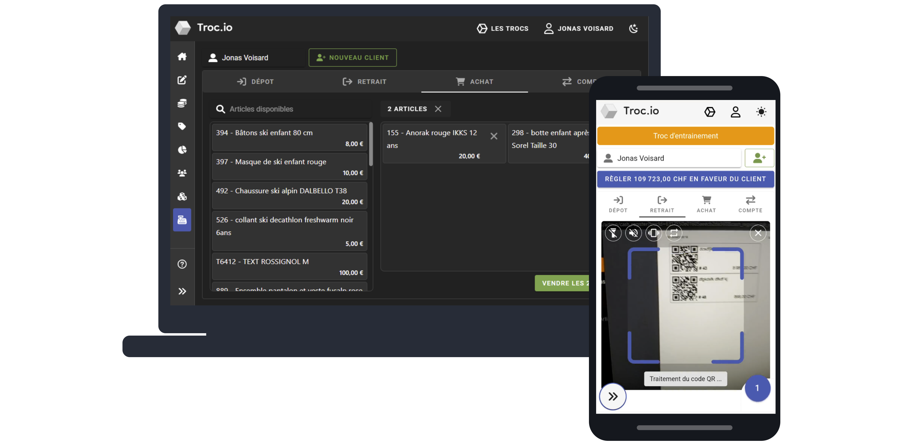

# Trocio

Plateforme pour l'organisation et la gestion de commerces éphémères.

> 👉 [Accéder à troc.io](https://troc.io)

> 👉 [Voir la roadmap](https://github.com/users/peufo/projects/5)



## Installation de l'environement de développement

Crée un fichier `.env` minimal qui écrase les valeurs de `config.ts`

```zsh
cp .env.example .env
```

Crée et installe les certificats avec [mkcert](https://github.com/FiloSottile/mkcert)

```zsh
mkcert localhost
mkcert -install
```

Si Docker est dispo:

```
docker-compose up
```

Sinon:

1. Installe les dépendances
2. Assures-toi que [ton serveur MongoDB](https://www.mongodb.com/try/download/community) est disponible
3. Démarre le serveur de dev

```zsh
npm install
npm run dev
```
